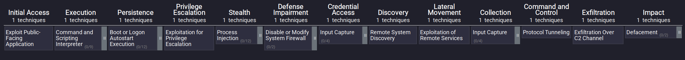

# CCDC Playbook
# **REMEMBER TO CHANGE PASSWORDS**
``` bash
passwrd #changes password
```

# Survelliance Commands

```bash
sudo systemctl list-units --type=service #For services
```
```bash
sudo ps -ef | [grep/less] #For active services
```
```bash
sudo ss -tulnp #For ports
```
```bash
who #For ssh
```

typically red teamers use reverse shells

# Kill Commands
```bash
sudo kill [-9] <PID> #Kill command based on PID
```
```bash
sudo systemctl disable [service] --now #Stop service on bootup
```
```bash
sudo systemctl stop [service] #Stop service (still works on bootup)
```
```bash
sudo pkill -9 -t [shell] #for disconnecting ssh users
```


# Logs


## Linux

```bash
/var/log #folder for all logs
```
```bash
/var/log/syslog /var/log/messages #Logs for fundamental systems
```
```bash
/var/log/auth.log /var/log/secure #Logs for authentication
```

### Auditd

```bash
auditctl -w /etc/passwd -p wra -k passwd #Creates a watcher for /etc/passwrd

auditctl -w [file] -p [read/write/attribute/execute] -k [name of watcher]

sudo auditctl -w /usr/bin/whoami -p x -k privilege_check #Check if whoami is called

/var/log/audit/audit.log #auditd log

auditctl -l #list out all existing logs
``` 


## Windows
**Event Viewer -> Windows Logs -> Application/System/Security**

[Windows Security Events Log](https://www.ultimatewindowssecurity.com/securitylog/encyclopedia/)

### Sysmon
[Sysmon Install](https://learn.microsoft.com/en-us/sysinternals/downloads/sysmon)
Download Sysmon and SwiftOnSecurityXML and run
[SwiftOnSecurityXML Install](https://github.com/SwiftOnSecurity/sysmon-config)
Do more research on this
```powershell
sysmon.exe -accepteula -i sysmonconfig-export.xml
```


# SIEM (Splunk)
## Installation
[Website Install](https://www.splunk.com/en_us/download.html)

Start Splunk
```bash/powershell
sudo -u $SPLUNK_USERNAME $SPLUNK_HOME/bin/splunk start --accept-license
```

### Indexer
```bash
sudo -u $SPLUNK_USERNAME $SPLUNK_HOME/bin/splunk enable listen 9997
sudo -u $SPLUNK_USERNAME $SPLUNK_HOME/bin/splunk add index linux
sudo -u $SPLUNK_USERNAME $SPLUNK_HOME/bin/splunk add index windows
sudo -u $SPLUNK_USERNAME $SPLUNK_HOME/bin/splunk restart
```

### Forwarder
```bash
sudo -u $SPLUNK_USERNAME $SPLUNK_HOME/bin/splunk add forward-server <your indexer ip>:9997
sudo -u $SPLUNK_USERNAME $SPLUNK_HOME/bin/splunk add monitor /var/log/syslog -index linux
sudo -u $SPLUNK_USERNAME $SPLUNK_HOME/bin/splunk restart
```
Then navigate to http://<your indexer ip>:8000
Make sure that port 8000 is enabled on your tcp firewall

Do more research on Splunk

# Threat Intelligence

Research These
1. How would I know red team used this TTP?
2. What can I do to prevent them from using it again?
3. What can I do ahead of time to stop them from using this TTP?

# Injects
TBD

# Windows
## CMD
| Linux | Windows |
|-------|---------|
| man  |  Help   |
| man  | /?  |
| ls | dir |

### Helpful Commands
```powershell
where [file] #Finds a file

findstr [str] [file] #finds a string in a file

fc [file1] [file2] #Compares differences in two files

sort [file] #Sorts the given input

hostname #Gets the hostname of the machine

ver #Gets the version number of the OS

ipconfig #Gets networking information

whoami/priv #Gets the privledges of the current user

whoami/ #Gets the groups of the current user

net user #See all users on host

net localgroup #See all local group

net group #See all groups on the domain

net share #Get information on shared resources
```


### Variables
%USERPROFILES% - The path of the current user's home directory
%PATH% - A list of paths where executables are located 
%PROGRAMFILES% - The path to the 64-bit program
%LOGONSERVER% - The login server for the machine

## Powershell

### Commands

| CMD | Powershell |
| ----| ---------- |
| dir | Get-ChildItem |

```powershell
Get-Alias #Get the alias of all commands
ls #Alias for Get-ChildItem
```

Commands to pipe into
```powershell
? #Filters out multiple objects, showing only those with the desired properties
select #Filters out properties, showing only the desired properties
sort #Sorts the objects in the desired order
```

```powershell
iwr #Use to grab data off of the web, like scripts!
```

Programs such as python set their binaries on "the path", which allows powershell to run their commands

If you know that a binary or program exists on a computer, yet the computer doesn't know how to run it, you may be experiencing an issue with the path.

### Variables
Use $ to declare a variable
Use = to set a variable

### Scripts
Powershell Scripts end with .ps1

### Modules
Modules contain multiple scripts
Some commandlets are not automatically installed on powershell
```powershell
Import-Module -Name ActiveDirectory #Imports ActiveDirectory Module
Get-Command -Module ActiveDirectory #Shows commands imported from ActiveDirectory Module
```
## Users & Groups

Local Accounts - accounts available both on and offline without needing to connect to microsoft

By default Windows creates a local admin (Administrator), guest account (Guest), and system account* (WDAGUtilityAccount)
Disable them

Users can have perimissions shared through groups. Generally you want to use groups to make sure you do not repeat yourself

### Managing Users through GUI
To manage local accounts, press Win+R, type lusrmgr.msc, and hit enter

### Managing Users through CMD/Powershell

**CMD**
```powershell
net user /? # Help Command

net user <user> /add #Add a user (no password)

net user <user> * #Add/change password for a user

net user <user> * /add #Add a user with a password

net user <user> delete #delete a user

net user <user> /active:no #disable a user

net localgroup <group> <user> /add #Add a user to a group

net localgroup <group> <user> /del #Remove a user from a group
```

**Powershell**
(Good for scripts!)
```powershell
$pwd= Read-Host -AsSecureString
New-LocalUser -Name "<user>" -Password $pwd -Description "<desc>" #Add user

Get-LocalUser -Name "<user>" #View user's info

Enable-LocalUser -Name "<user>" #Enable a user

Disable-LocalUser -Name "<user>" #Disable a user

$pwdChange= Read-Host -AsSecureString 

Set-LocalUser -Name "<user>" -Password $pwdChange #Change a password

Remove-LocalUser -Name "<user>" #Delete a user

Get-LocalGroupMember -Group "<group>" #View members in a group

Add-LocalGroupMember -Group "<group>" -Member "<user>" #Add a member to a group
```

## User Access Control
type **UAC**
Enable this feature as soon as possible

## Active Directory

**Server Manager -> Tools -> Active Directory Users and Computers**

Powershell Commands
```powershell
Get -ADUser -Identity <user> #Get a user's basic info

Get-ADUser -filter "samaccountname -like 'a*'" #Gets all user accounts that start with a

New-ADUser -Name "<user>" -SamAccountName "<username>" -UserPrincipalName "<username>@<domain>" #Adds a new AD user to the domain
```

## File System

C:\Windows\ - Core OS files
C:\Program Files\ - Non-OS applications
C:\Users\ - User Directory
C:\Temp\ - Temporary storage. Malware likes to hide here.

Hover over type in file explorer and select "hide" to see hidden files

### File types
.dll - A shared file that has programming functions that multiple programs can reference simultaneously
.etl - Event trace log file. Critical for forensic analysis
.lnk - shortcut file that has a pointer to the real file
.pf - Can speed up launch times of files

## Process System Hierarchy
Services you should never stop:
- System 
- smss.exe  
- csrss.exe  
- wininit.exe  
- services.exe  
- svchost.exe  
- runtimebroker.exe  
- taskhostw.exe  
- Isass.exe  
- winlogon.exe  
- logonui.exe  
- userinit.exe  
- explorer.exe  


System
- PID = 4
- Runs in kernel mode
- Local System user account
- Child process is smss.exe

smss.exe
- Creates environment variables and sessions

csrss.exe
- Allows the Windows API to be available to other processes

wininit.exe
- Initializes core system components during boot

services.exe
- Handles system services on the machine

svchost.exe
- Image path is %SystemRoot%\System32\svchost.exe

runtimebroker.exe
- Permission manager

taskhostw.exe
- Handles DDLs which are used by other programs

Isass.exe
- Enforces security policy and user logons

winlogon.exe
- Image path is %SystemRoot%\System32\winlogon.exe

logonui.exe
- Image path is %SystemRoot%\System32\LogonUI.exe

userinit.exe
- Initializes a user session at login

explorer.exe
- Image path is %SystemRoot%\System32\explorer.exe

You can see this information in the process explorer tool 

## Networking & Firewalls

The priority for firewall rules in windows is:
1. Authenticated Bypass
2. Deny rules
3. Allow Rules
4. Default profile behavior

Configuring the firewall
Open windows defender firewall

In customize settings you can block any incoming connections 

Advanced settings allow me to block specific ports

Right click to make new rules
You can make custom rules

With a website you want to make sure that you block TCP port 80

You can export your firewall rules to make a backup

**Windows defender firewall properties**

- You can set up firewall logging
- You can turn your firewall on

## Windows Defender

Turn on Controlled Folder Access

4 scan types 

Quick scan: Do this to check common locations for malware
Full scan: Run this ASAP
Custom: Good for specific directories

Offline: Shuts the computer/service down but does a deep scan

Watch for Red Team adding exclusion paths to your system

1. Scheduled Tasks
An attacker can create a scheduled task that turns off defender periodically.

2. Registry Keys
A malicious or corrupt registry key can prevent Defender from running.

## Windows Registry
**Editing this might break the system if you are not careful**

Script the initial registry changes

PATH    VALUE 	DESCRIPTION
HKLM\Software\Microsoft\Windows\CurrentVersion\Explorer\SmartScreenEnabled 	1 	Enable SmartScreen
HKLM\System\CurrentControlSet\Control\Terminal Server\fDenyTSConnections 	1 	Disable RDP
HKLM\System\CurrentControlSet\Control\SecurityProviders\WDigest\UseLogonCredential 	0 	Disable plaintext PWD storage

It is common for windows defender to break because of malicious keys


Possible persistence locations:

(HKCU|HKLM)\Software\Microsoft\Windows\CurrentVersion\Run

HKCU\Software\Microsoft\Windows\CurrentVersion\RunOnce          Run a program
HKLM\Software\Microsoft\Windows NT\CurrentVersion\Winlogon\Shell 	User shell
HKLM\System\CurrentControlSet\Control\Session Manager\BootExecute 	Boot persistence


## Hardening

> Set-SmbServerConfiguration-EnableSMB1Protocol $false

> Disable-WindowsOptionalFeature -Online -FeatureName “SMB1Protocol”

> netsh advfirewall set allprofiles state on


For DNS
> Set-DnsServerGlobalQueryBlockList -List "wpad,isatap" -PassThru
 

# Linux

## Users and Groups

```bash
passwd -l [user] #Lock a user
userdel -r [user] #Delete a user
who #Shows active users
last #shows login history
visudo #edits sudoers file
```

**Files with user information**
```bash
/etc/passwd #information on all users
/etc/shadow #privledged file that has security information for each user
/etc/sudoers #contains information on who is a user sudo on the machine
~/.ssh/authorized_keys #contains the ssh keys for the user of the home directory
```


# External Tools

## System Informer (Windows)
- Tells you the user who ran the program
- Allows you to search the process online
- Gives you the PID of tasks

## msert
- Windows defender

# Basic networking

## TCP/IP model

IP points to a machine while MAC points to hardware

ARP request a mac address given an ip

## ICMP

```bash
ping [ip] #pings a thingy
```

## Ports

Block all ports that are not necessary for the service

## Routers / Firewalls

NAT makes it so your public ip address is one router

**Research Iptables**

Your router is your most important firewall


# Scripts

Powershell: iwr
Linux: wget